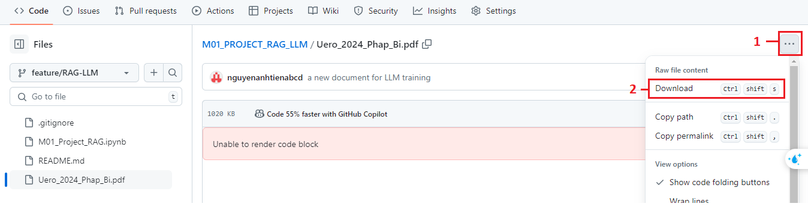
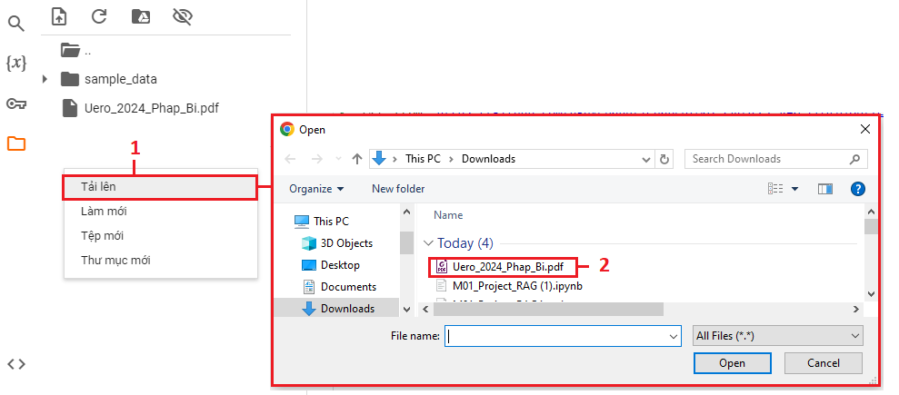
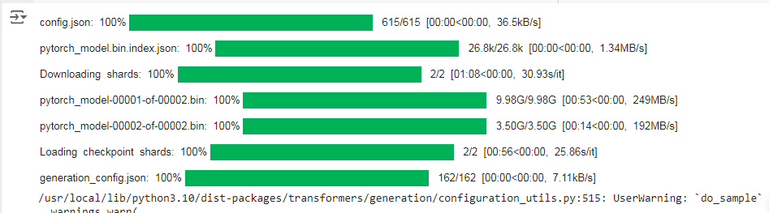
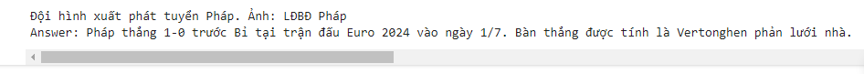

# M01_PROJECT_RAG_LLM
Large Language Model - Vicuna

steps to do RAG (Retrieval-Augmented Generation) with Vicuna (a Large Language Model with 7 billions parameters) in **Colab**<br>  

**Step 1:** Install necessary libraries   
Download *requirement.txt* file to the colab and install necessary libraries.  
Execute the following codes:
```python
!gdown https://github.com/nguyenanhtienabcd/M01_PROJECT_RAG_LLM/blob/feature/RAG-LLM/requirements.txt
```
```python
!pip install -q -r requirements.txt
```
<br>  

**Step 2:** import necessary libraries  
Execute the following codes:
```python
import torch
from transformers import BitsAndBytesConfig
from transformers import AutoTokenizer, AutoModelForCausalLM, pipeline
from langchain_huggingface import HuggingFaceEmbeddings
from langchain_huggingface.llms import HuggingFacePipeline
from langchain.memory import ConversationBufferMemory
from langchain_community.chat_message_histories import ChatMessageHistory
from langchain_community.document_loaders import PyPDFLoader, TextLoader
from langchain.chains import ConversationalRetrievalChain
from langchain_chroma import Chroma
from langchain_text_splitters import RecursiveCharacterTextSplitter
from langchain_core.runnables import RunnablePassthrough
from langchain_core.output_parsers import StrOutputParser
from langchain import hub
```
<br>  

**Step 3:** Read file pdf  
download (or upload) a document file using for RAG with LLM  
Excute the following codes:
```python
!gdown https://github.com/nguyenanhtienabcd/M01_PROJECT_RAG_LLM/blob/feature/RAG-LLM/Uero_2024_Phap_Bi.pdf
```
Or download this file to your computer and then upload to **colab**  
*you can do with your new document to **Colab***
  
 <br><br>  

Read file pdf
```python
Loader = PyPDFLoader
FILE_PATH = '/content/Uero_2024_Phap_Bi.pdf' # path of your document
loader = Loader(FILE_PATH)
documents = loader.load()
```
<br>  

```python
# split documents by splitter 
text_splitter = RecursiveCharacterTextSplitter(chunk_size =1000 ,
                                               chunk_overlap =100)
docs = text_splitter . split_documents ( documents )
print("Number of sub - documents: ", len(docs))
print(docs[0])
```  
<br>  

**Step 4:** Vectorisation: Convert text to vector
```python
embedding = HuggingFaceEmbeddings()
```
```python
# create a vector database
vector_db = Chroma.from_documents(documents =docs ,embedding = embedding)
retriever = vector_db.as_retriever()
# queue any short text here (any short text that related to your document)
result = retriever.invoke(" Uero 2024, Pháp và Bỉ?")
print(" Number of relevant documents : ", len(result))
```
<br>  

**Step 5:** Initialise LLM model
```python
# quantization
nf4_config = BitsAndBytesConfig(load_in_4bit =True ,
                                bnb_4bit_quant_type ="nf4",
                                bnb_4bit_use_double_quant =True ,
                                bnb_4bit_compute_dtype = torch . bfloat16)
 # Initialise model and token
MODEL_NAME = "lmsys/vicuna-7b-v1.5"
model = AutoModelForCausalLM.from_pretrained(MODEL_NAME,
                                            quantization_config = nf4_config,
                                            low_cpu_mem_usage = True)

tokenizer = AutoTokenizer.from_pretrained(MODEL_NAME)
```
  
<br>  

**Step 6:** Intergrate tokenizer and model into a pipeline
```python
model_pipeline = pipeline('text-generation',
                          model =model,
                          tokenizer = tokenizer,
                          max_new_tokens =512,
                          pad_token_id = tokenizer.eos_token_id,
                          device_map = " auto "
                          )
llm = HuggingFacePipeline(pipeline = model_pipeline)
# promt created by the RAG technique
prompt = hub.pull("rlm/rag-prompt")
def format_docs(docs):
  join_doc = "\n\n".join(doc.page_content for doc in docs )
  return join_doc

rag_chain = (
{"context": retriever | format_docs, "question": RunnablePassthrough()}
| prompt
| llm
| StrOutputParser ()
)
# type your question here
USER_QUESTION = "trận đấu giữa Pháp và Bỉ ở Euro 2024, đội nào thắng, thắng bao nhiêu bàn, ai ghi bàn thắng?"
output = rag_chain.invoke(USER_QUESTION)
answer = output.split('Answer :')[0].strip ()
print(answer)
```
*the answer of LLM:*
 

the answer is quite correct.


